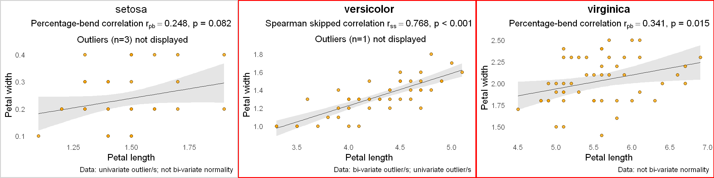

# Which correlation method to use?

**Pearson's correlation** is the most popular for continuous data. However, if data has outliers or does not meet the normality assumption, Pearson's correlation is inappropriate. Instead, one should use robust correlation methods, for example, **Spearman skipped** or **percentage-bend** correlation. On the other hand, if data is normally distributed and has no outliers, Pearson's correlation gives more power. Here I provide an R-script `flexible_correlations.r` that first inspects the data for outliers and normality and then chooses the most appropriate of the three correlation methods. Based on [Pernet et al. (2013)](https://doi.org/10.3389/fpsyg.2012.00606 "Pernet, C. R., Wilcox, R. R., & Rousselet, G. A. (2013). Robust correlation analyses: false positive and power validation using a new open source matlab toolbox. Frontiers in psychology, 606."), I follow three simple rules for selecting the correlation method:
* **Pearson's correlation**: Data is normally distributed and has no outliers
* **Spearman skipped correlation**: Data has bi-variate outliers
    * Using the minimum covariance determinant (MCD) estimator
* **(20%) Percentage-bend correlation**: Data has no bi-variate outliers but is not normally distributed or has univariate outliers

# Example output

# Examples and description
See the accompanied `Jupyter Notebook` [description-and-examples.ipynb](https://github.com/dcdace/R_functions/blob/main/flexible-correlations/description-and-examples.ipynb). 

You can also interact with the notebook through the Binder. 

